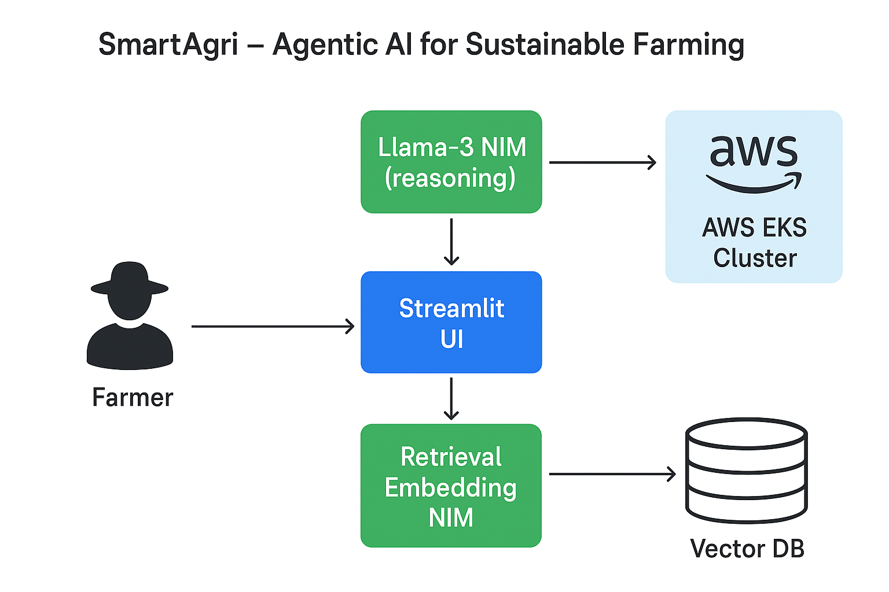

# 🌾 SmartAgri – Agentic AI  
**AI-powered Farming Assistant built using AWS & NVIDIA Agentic AI**  

SmartAgri helps farmers make intelligent, real-time agricultural decisions using an **Agentic AI system** powered by **AWS** and **NVIDIA NIM**.  
It analyzes farm data, predicts crop health, recommends irrigation schedules, and optimizes fertilizer use — all through an easy-to-use web interface.  

---

## 🚀 Features  
- 🌦️ Real-time weather & soil condition analysis  
- 🤖 AI crop recommendation using **Llama-3 Agentic model**  
- 🔍 Retrieval Embedding NIM for contextual data search  
- ☁️ Deployed on AWS SageMaker / EKS cluster  
- 📊 Streamlit dashboard for easy farmer interaction  

---

## 🧠 Tech Stack  
- **Language:** Python  
- **Framework:** Streamlit  
- **AI Model:** Llama-3 1-nemotron-nano-8B-v1  
- **Cloud:** AWS SageMaker / EKS  
- **NVIDIA NIM:** Inference + Retrieval Embedding  
- **Storage:** S3 / DynamoDB  

---

## 🏗️ Architecture  


---

## 💡 How It Works  
1. User inputs soil & crop details.  
2. AI Agent (Llama-3 + Retrieval NIM) analyzes past and live data.  
3. Generates insights like best crop, water usage, and fertilizer timing.  
4. Dashboard shows results in a clean Streamlit interface.  

---

## ⚙️ Deployment Instructions  
1. Clone this repository  
   ```bash
   git clone https://github.com/Kesava09-gif/SmartAgri-AgenticAI
   cd SmartAgri-AgenticAI
   ```
2. Install dependencies  
   ```bash
   pip install -r requirements.txt
   ```
3. Run locally  
   ```bash
   streamlit run app.py
   ```
4. Deploy on cloud  
   Use `deployment.yaml` and `service.yaml` with AWS EKS or SageMaker  

---

## 🎥 Demo Video  
Coming soon — watch the demo on YouTube  
(Link to be added after uploading the video)

---

## 🧩 Future Enhancements  
- Add voice-based farmer interaction  
- Expand dataset for regional crop types  
- Integrate IoT sensors for real-time soil monitoring  

---

## 👥 Team  
**Kesavanath Mathi**  
Developer | AI Enthusiast | AWS & NVIDIA Hackathon 2025  

---

## 🏆 Submission for  
**Agentic AI Unleashed: AWS & NVIDIA Hackathon 2025**  
> Build the future of Agentic AI with AWS and NVIDIA 🚀  
